## 项目说明

**项目目标与功能**

> 分析股价综合分析预测工具的功能需求，研究其设计及实现技术。设计股价综合分析预测工具的总体结构，实现如下功能：
>
> - **展示大盘指数行情、股票对比分析、个股信息分析**
> - **明日股价预测、股价区间预测、股价走势预测、股价涨跌预测**
> - **登入、注册，登出**
> - 对所实现的部分进行测试和评价。·

**项目技术栈**

> - 生态：Python 3.8
>
> - Web框架：Django 3
>
> - 数据存储技术：Dataframe文件存储
>
> - 深度学习框架：keras
>
> - 前端技术：bootstrap4+jquery+ajax+echats
>
> - 算法：lstm，归一化

**项目结构**

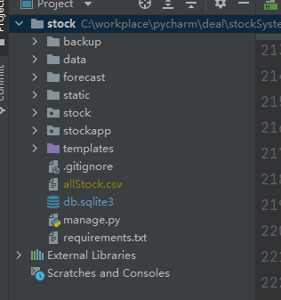

**结构说明**

> - stock：Django项目的主app
>
> - stockapp：实现股票展示、预测、更行等操作的app
>
> - forecast:算法模块，存放预测算法、数据处理函数、各种工具类函数。
>
> - static：存放系统各种静态资源（js，css）
> - templates:存放前端html页面
>   - stockList.html：主页，展示所有股票的列表
>   - stockDetail.html：股票详情页，展示股票的详细信息
>   - stockSinglePredict.html：股票预测页，展示针对单个股票的预测结果（包含股票走势、区间、变化、明日股价1）
>   - stockComparison.html：股票对比页面，对比两只股票的信息
>   - marketIndex.html：展示大盘指数
> - data：ts_code.csv(代码为ts_code的股票的数据存放文件)，allStock.csv(存放所有股票的简要信息)
> - backup：保存临时的代码文件，无用，可以直接删除

**重点说明stockapp下的各种文件作用**

> 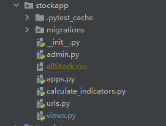
>
> .pytest_cache：系统缓存文件
>
> migrations/：此目录包含Django应用程序的数据库迁移文件。每当您更改数据库表时，都应该创建一个新的迁移文件，并运行migrate命令来将更改应用于数据库。
>
> app.py：此文件定义了Django应用程序的配置。您可以在这里指定应用程序的名称，URL配置和其他设置。
>
> url.py：此文件包含Django应用程序的URL配置。您可以在这里定义哪些URL应该与哪些视图函数匹配，并将它们映射到适当的视图函数。
>
> views.py：此文件包含Django应用程序的视图函数。视图函数处理来自URL的请求，并根据需要从数据库中检索数据，并将其呈现为HTML响应。
>
> calculate_indicators.py：计算股票的各种指标

Stock**下各种文件的作用**：

> 
>
> - settings.py：此文件包含Django项目的所有设置。您可以在这里指定数据库配置，静态文件路径，安装的应用程序列表等等。
> - forms.py：此文件包含Django应用程序的表单类。表单类用于验证用户提交的数据，并将其转换为模型实例。
>
> - manage.py：此文件是Django项目的命令行工具。您可以使用它来运行服务器，创建数据库迁移，运行测试等等。

## 项目部署与运行

**准备工作**

项目用到了tushare 的api，需要使用者自行去tushare官网申请账号，获取api token填写到如下的位置：

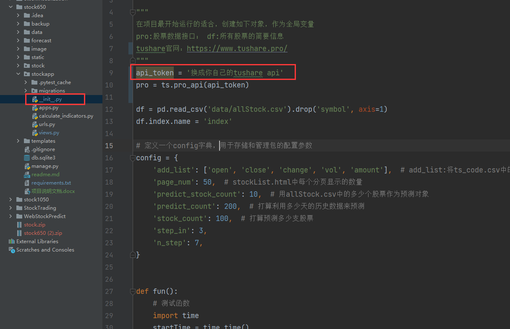

tushare官网：[Tushare数据](https://www.tushare.pro/)

获取api token的url：[Tushare数据](https://www.tushare.pro/user/token)

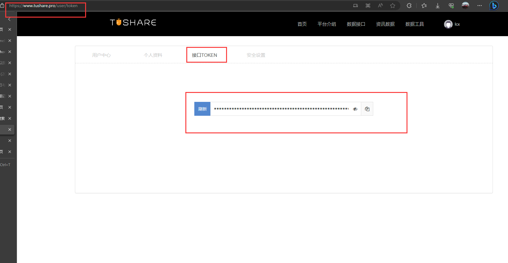

**部署项目**：你需要安装项目所需要的一切相关的python库。

1 用pycharm打开项目，右下角选择你的python环境 

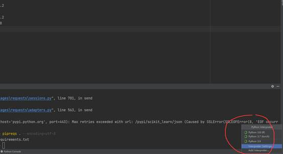

2 然后代开终端terminal， 输入：pip install --file requirements.txt

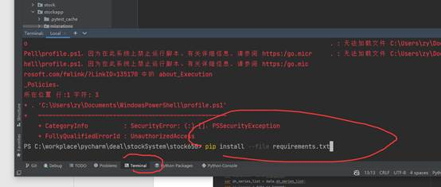

 

**运行方式**：

方式一：终端输入：python manage.py runserver

方式二（推荐）：

1 点击如图所示位置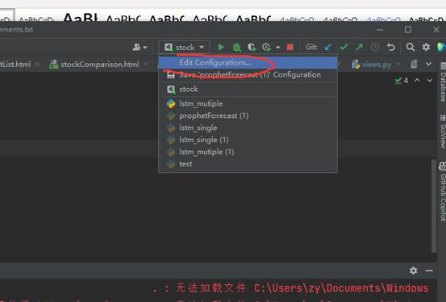

2 选择你的环境

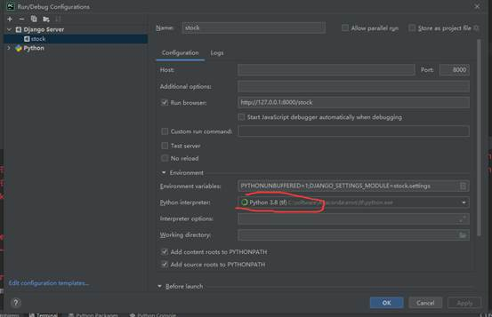

3 点击如下按钮：

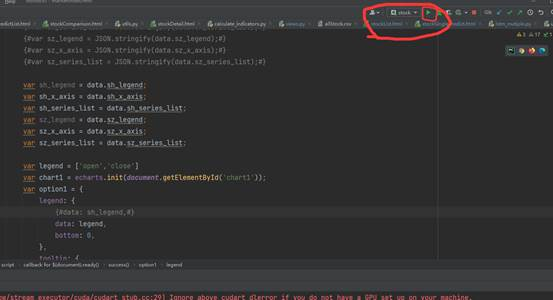

## 项目效果展示

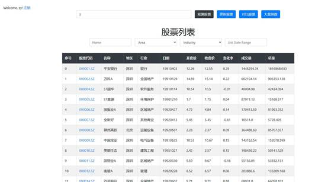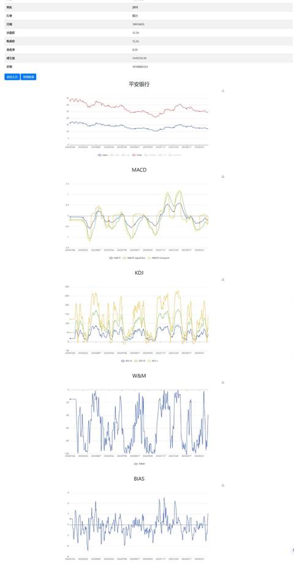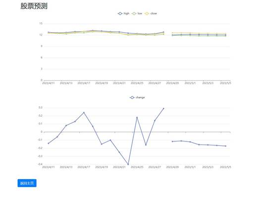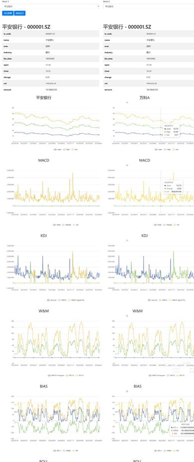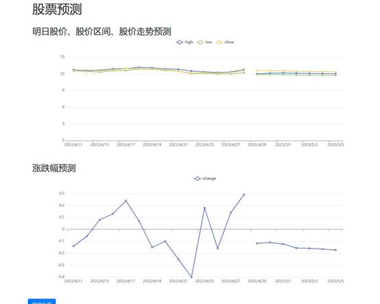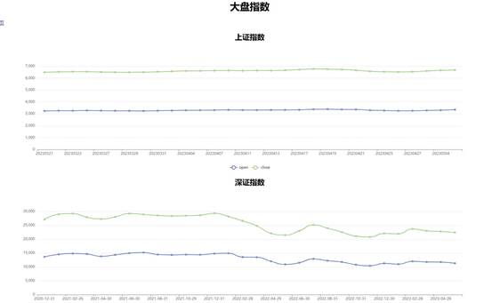

 

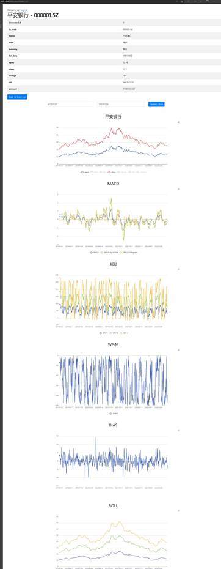

 

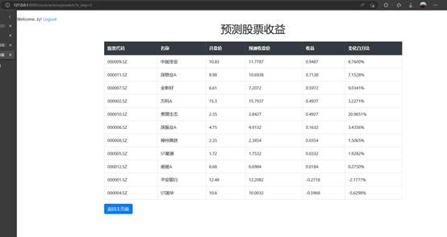

## 使用注意事项

主页最上面的第两个按钮是更新所有股票数据的。因为数据量很大，所以这个操作都非常费时间。之所以这么慢是因为股票的数据量很大 。**在进行股票更新，不要进行其他操作，否则会更新或者预测失败。**

其次就是更行股票了，就是从网上获取最新的股票数据更新到心里的data文件夹中，保持数据的实时性。同样地，因为有100个股票，所以更行股票操作需要**好几十分钟**，比较慢。